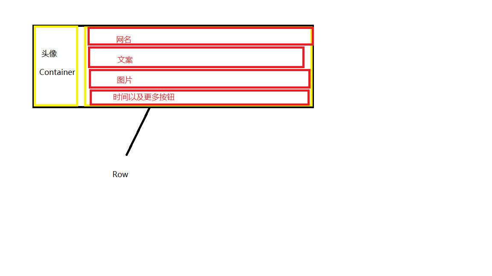

# study_demo

一个学习 flutter 的 demo.

## 目录结构

lib
├── dao // API 接口
├── model // 序列化 json
├── pages // 页面
├── routes // 路由
├── widgets // 小组件
└── main.dart // 入口

## 布局结构

### 1.Tabs布局

首先用一个Scaffold组件，先不用AppBar，因为每个tab页的AppBar可能不一样，所以留到子页面中用。组件中body用一个PageView用于Tabs栏切换，再用一个bottomNavigationBar组件，用于控制Tabs栏切换的底部按钮。

### 2.Layout and Native页面布局

首先用一个Scaffold组件，里面添加AppBar对应当前页面的标题，由于整个页面可能很内容很多，所以需要滚动条，所以就body中先添加一个ListView组件，然后ListView中添加Card卡片组件，因为每个卡片组件需要路由跳转，所以需要点击事件，所以在Card里面添加一个InkWell给他一个onTap，然后点击可以路由跳转。

### 3.商城标题以及横向商品（Demo—01）

首先用个Scaffold组件，AppBar中给对应当前页面的标题。当前页面可能内容很少，用不上滚动条，但是一个正常的页面的话，内容肯定不止这么点，所以我们先添加一个ListView

title部分的布局：用了一个Container组件给了高度32，margin-left 20，padding-left 20，然后一个宽度为10的红色左边框，child中给了一个Text组件。

主体部分的布局：这个需要一个横向的滚动条，由于ListView里不能直接使用ListView，所以我们先添加一个Container把内容撑高，然后再添加一个ListView，并且使用scrollDirection: *Axis*.horizontal把这个ListView变成横向滚动。应为商品列表分两部分，上面为图片下面为价格，所以我们用了Column组件，上面部分先给个Container组件以便控制图片的长和宽，然后添加image组件。下面部分也是先添加Container组件 以便控制文字的边距和，然后添加Text组件。

### 4.微信朋友圈（Demo—02）

#### 4.1.布局

首先一个Scaffold组件，body中放*MediaQuery*.removePadding，应为我们朋友圈的背景图是占满手机状态栏的，所以我们要清除组件的自带padding。然后这个页面就不需要AppBar了，要去自定义AppBar了，所以我们使用了Stack层叠组件，Stack的children中分了两块分别为页面的AppBar和body部分。

##### AppBar：

Appbar最外层同样是一个Container组件首先给他设置了一个padding让他离顶部有25，不让他进入状态栏中，给了个80的高度。应为是个横向的内容，所以就用了个row组件，然后row中用了个css中的经典布局（圣杯布局）。

分别用了三个组件：

应为自定义的AppBar不像Scaffold中自带的AppBar，他没有返回的按钮，所以在左边写了一个IconButton，给了他点击事件，然后通过`Navigator.pop(context)`返回到上一页。

中间部分用了`Expanded`组件，也就是css中的flex布局，让他的属性flex等于1，这个是让他占满一行，这行剩下的空间有多大就占多大，然后给他的child一个Text组件，把我们的title朋友圈给他写上。

右边部分也是一个`IconButton`目前我们只做显示，不写其他功能。

##### body:

应为我们需要页面滚动，所以我们需要添加ListView组件,然后组件中我们分别分了两部分，一部分为为上面的背景图部分，一部分为下面的Card部分。

###### 背景图部分：

首先还是一个Container组件，给了他一个margin距离下面60，然后背景图上面还需要一个头像，所以我们用了Stack层叠组件。然后里面分为两个组件，第一个是一个Container，放的是我们的背景图，宽度用`double.infinity`设置为占满全屏，高度暂且设置为300。第二个是一个row组件，应为我们头像和网名分为了左右两部分，row是占满全屏的，所以给他`mainAxisAlignment`属性为`MainAxisAlignment.end`,让他的内容靠右。row中写了两个组件，分别为Text组件，里面放了网名，然后右边放了一个Container组件，给了他宽高以及margin。然后我们头像是一个圆形的，我们这个Container组件有个decoration属性，我们用ShapeDecoration修饰他，里面首相放我们的图片，然后有个shape属性，我们用RoundedRectangleBorder修饰他，然后他有个这个borderRadius属性，我们给他*BorderRadiusDirectional*.circular(10)。

###### card部分

首相我们是用了一个Column组件分别左边为头像，右边为文案网名等，左边头像就不多说了，和上面背景图里面的头像一样。右边是个竖着排列的排版，所以我们选择用Column组件，然后Column没有宽度，所以我们在他外卖包裹了一个Container组件,并且通过计算写出来了剩下的宽度 *MediaQuery*.of(context).size.width - 60，通过屏幕的宽度减除头像的宽度。然后网名和文案没什么东西，就只写Text组件。图片部分也没就也只是写了几张图片上面。然后就是最下面部分时间以及更多了，应为是个横向的布局，所以我们就写了一个Row组件，给了个属性mainAxisAlignment: *MainAxisAlignment*.spaceBetween,让他的子元素同等的间隔，并且两边都靠边。



###### 滚动监听

我们需要在ListView外面包裹一层*NotificationListener*，我们用它的onNotification监听滚动。当自定义的AppBar超过了背景图，就计算出我们AppBar透明度，然后改变AppBar两个icon的颜色，并显示出AppBar的title。然后当我们滚动到最底部的时候，我们要发请求去获取下一页的数据。

###### 下拉回调

我们在*NotificationListener*外面再加一层*RefreshIndicator*用于下拉回调，在他的onRefResh中写下我们在下拉回调中要处理的东西，比如说我们给这个朋友圈的的List清空，然后让page=1，再发一遍请求。

## 网络请求

首先发http请求，然后通过nodel类序列化json。

详细案例见`study_demo -> lib -> dao ->ProductDao.dart`

### 1.Dio

#### Examples 

执行 `GET` 请求:

```dart
Response response;
Dio dio = new Dio();
response = await dio.get("/test?id=12&name=wendu");
print(response.data.toString());
// Optionally the request above could also be done as
response = await dio.get("/test", queryParameters: {"id": 12, "name": "wendu"});
print(response.data.toString());
```

执行 `POST`  请求:

```dart
response = await dio.post("/test", data: {"id": 12, "name": "wendu"});
```

### 2.序列化json之model类

[JSON to Dart](https://javiercbk.github.io/json_to_dart/)